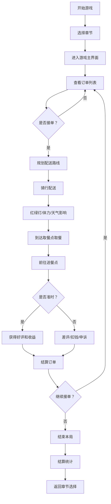

## 1. 产品概述

城市夜班外卖骑手模拟游戏，玩家扮演深夜外卖骑手，在雨夜、商圈和老旧小区之间接单送餐，体验节奏管理与选择后果的策略玩法。

- 核心玩法：资源管理 + 路线规划 + 决策取舍
- 目标用户：喜欢模拟经营、策略决策类游戏的玩家
- 产品价值：沉浸式体验外卖骑手的夜间工作生活，强调节奏感与选择的重要性

## 2. 核心功能

### 2.1 用户角色
| 角色 | 注册方式 | 核心权限 |
|------|----------|----------|
| 玩家 | 本地存档 | 完整游戏体验，章节解锁，装备购买，技能成长 |

### 2.2 功能模块

1. **主界面**：地图面板、订单面板、背包面板、车辆面板、消息面板、结算面板
2. **游戏核心**：接单系统、路线规划、红绿灯、体力系统、餐品保温、车辆耐久、充电补给
3. **关卡系统**：六个章节关卡，难度递进
4. **成长系统**：装备购买、技能成长、排行榜
5. **剧情系统**：剧情短信、顾客沟通、异常报备、差评申诉

### 2.3 页面详情

| 页面名称 | 模块名称 | 功能描述 |
|----------|----------|----------|
| 开始界面 | 章节选择 | 选择关卡章节，查看章节介绍和难度 |
| 开始界面 | 排行榜 | 查看历史最高分和成就 |
| 游戏主界面 | 地图面板 | 显示城市地图、骑手位置、订单地点、路线规划 |
| 游戏主界面 | 订单面板 | 显示可接订单、当前配送订单、订单详情 |
| 游戏主界面 | 背包面板 | 显示物品装备、餐品状态、道具使用 |
| 游戏主界面 | 车辆面板 | 显示车辆状态、电量、耐久、升级选项 |
| 游戏主界面 | 消息面板 | 剧情短信、顾客消息、系统通知 |
| 游戏主界面 | 结算面板 | 本局结算、收益统计、评价反馈 |

## 3. 核心流程

## 4. 用户界面设计

### 4.1 设计风格

- **设计主题**：赛博朋克雨夜风格，深蓝色调搭配霓虹灯光
- **主色调**：深蓝底色 (#0a1628)，霓虹蓝 (#00d4ff)，霓虹粉 (#ff00aa)，暖黄 (#ffcc00)
- **按钮风格**：圆角矩形，霓虹发光边框，悬停时有脉冲光效
- **字体**：标题使用等宽科技感字体，正文使用清晰易读的无衬线字体
- **布局风格**：面板式布局，半透明毛玻璃效果，深色背景
- **图标风格**：线性霓虹风格图标，发光效果
- **氛围效果**：雨丝粒子效果，路面反光，霓虹光晕

### 4.2 页面设计概览

| 页面名称 | 模块名称 | UI 元素 |
|----------|----------|----------|
| 开始界面 | 章节选择 | 卡片式章节列表，霓虹边框，章节解锁状态，难度标识 |
| 游戏主界面 | 地图面板 | 城市网格地图，骑手图标，订单标记，路线高亮，雨丝效果 |
| 游戏主界面 | 订单面板 | 订单卡片列表，倒计时动画，收益显示，接单按钮 |
| 游戏主界面 | 状态栏 | 体力条、电量条、时间显示、金额显示、天气图标 |
| 游戏主界面 | 消息面板 | 聊天气泡样式，短信通知动画，未读标记 |
| 结算界面 | 结算面板 | 收益统计图表，评价展示，技能提升提示 |

### 4.3 响应式

- 桌面端优先设计，最小支持 1280x720 分辨率
- 面板可拖拽调整位置，适应不同屏幕布局
- 触控优化：按钮尺寸适合点击操作

### 4.4 视觉特效

- 雨滴粒子系统，模拟雨夜效果
- 霓虹灯光晕和闪烁效果
- 车辆行驶时的拖尾特效
- 订单完成时的庆祝动画
- 面板切换的滑动过渡动画
- 倒计时紧张时的红色脉冲效果
