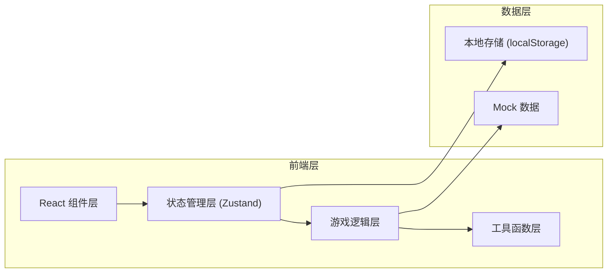

## 1. 架构设计



## 2. 技术描述

- **前端框架**: React 18 + TypeScript
- **构建工具**: Vite
- **样式方案**: Tailwind CSS 3
- **状态管理**: Zustand
- **路由管理**: React Router DOM
- **图标库**: Lucide React
- **动画**: CSS Animations + Framer Motion (可选)
- **数据存储**: localStorage 本地存档

## 3. 目录结构

```
src/
├── components/          # 通用组件
│   ├── ui/             # 基础UI组件
│   └── game/           # 游戏相关组件
├── pages/              # 页面组件
│   ├── StartPage/      # 开始页面
│   └── GamePage/       # 游戏主页面
├── store/              # Zustand 状态管理
│   ├── gameStore.ts    # 游戏主状态
│   └── playerStore.ts  # 玩家数据
├── data/               # 游戏数据配置
│   ├── chapters.ts     # 章节配置
│   ├── orders.ts       # 订单模板
│   ├── items.ts        # 装备物品
│   └── skills.ts       # 技能系统
├── utils/              # 工具函数
│   ├── gameLogic.ts    # 游戏逻辑计算
│   ├── mapUtils.ts     # 地图工具
│   └── storage.ts      # 本地存储
├── types/              # TypeScript 类型定义
│   └── index.ts
├── hooks/              # 自定义 Hooks
│   ├── useGameLoop.ts  # 游戏循环
│   └── useTimer.ts     # 计时器
├── App.tsx
└── main.tsx
```

## 4. 路由定义

| 路由 | 页面 | 用途 |
|------|------|------|
| / | StartPage | 开始界面，章节选择 |
| /game/:chapterId | GamePage | 游戏主界面 |
| /leaderboard | LeaderboardPage | 排行榜页面 |

## 5. 数据模型

### 5.1 核心数据类型

```typescript
// 玩家状态
interface Player {
  id: string;
  name: string;
  level: number;
  exp: number;
  money: number;
  stamina: number;       // 体力 0-100
  maxStamina: number;
  skills: Skill[];
  equipment: Equipment;
  unlockedChapters: string[];
  highScores: Record<string, number>;
}

// 车辆状态
interface Vehicle {
  type: string;
  durability: number;    // 耐久度 0-100
  maxDurability: number;
  battery: number;       // 电量 0-100
  maxBattery: number;
  speed: number;         // 基础速度
}

// 订单
interface Order {
  id: string;
  type: 'normal' | 'urgent' | 'large' | 'special';
  restaurant: string;
  customer: string;
  pickupLocation: Point;
  dropoffLocation: Point;
  reward: number;
  timeLimit: number;     // 剩余时间(秒)
  foodTemperature: number; // 餐品温度 0-100
  status: 'pending' | 'accepted' | 'picked' | 'delivered' | 'failed';
  customerNote?: string;
}

// 地图节点
interface MapNode {
  id: string;
  x: number;
  y: number;
  type: 'road' | 'intersection' | 'restaurant' | 'building' | 'charging';
  name?: string;
}

// 章节
interface Chapter {
  id: string;
  name: string;
  description: string;
  difficulty: number;
  weather: WeatherType;
  timeLimit: number;     // 章节总时长
  orderDensity: number;  // 订单密度
  targetEarnings: number; // 目标收益
  unlocked: boolean;
}

// 天气
type WeatherType = 'clear' | 'light_rain' | 'heavy_rain' | 'storm';

// 消息
interface Message {
  id: string;
  sender: string;
  content: string;
  timestamp: number;
  type: 'story' | 'customer' | 'system';
  read: boolean;
}
```

### 5.2 状态管理结构

```typescript
// 游戏状态
interface GameState {
  // 当前游戏状态
  isPlaying: boolean;
  isPaused: boolean;
  currentChapter: Chapter | null;
  gameTime: number;        // 游戏内时间
  remainingTime: number;   // 剩余时间
  
  // 玩家位置
  playerPosition: { x: number; y: number };
  currentRoute: Point[];
  
  // 订单
  availableOrders: Order[];
  activeOrders: Order[];
  deliveredOrders: Order[];
  
  // 车辆
  vehicle: Vehicle;
  
  // 体力
  stamina: number;
  
  // 当前收益
  currentEarnings: number;
  tips: number;
  
  // 消息
  messages: Message[];
  
  // 天气
  weather: WeatherType;
}
```

## 6. 游戏循环设计

- **主循环**: 60fps，使用 requestAnimationFrame
- **游戏时间**: 每秒推进一定游戏时间（可配置倍率）
- **状态更新**: 
  - 车辆位置更新
  - 订单倒计时更新
  - 体力消耗/恢复
  - 电量消耗
  - 餐品温度下降
  - 新订单生成
- **事件系统**: 红绿灯事件、顾客消息、剧情触发

## 7. 核心游戏机制

### 7.1 路线规划
- 地图采用网格系统
- 使用 A* 算法计算最短路径
- 考虑红绿灯等待时间
- 考虑天气对速度的影响

### 7.2 接单策略
- 同时可接多个订单
- 订单有时间限制
- 超时会扣钱和差评
- 需要权衡收益和风险

### 7.3 资源管理
- 体力：持续消耗，需要休息恢复
- 电量：车辆电量，需要充电
- 餐品温度：随时间下降，影响评价
- 车辆耐久：使用损耗，需要维修

### 7.4 评价系统
- 配送速度评分
- 餐品温度评分
- 服务态度评分
- 差评可申诉（有成功率）
